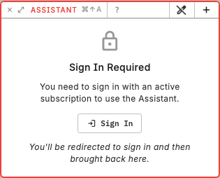

# AI assistant

The AI assistant is meant to cut repetitive work while leaving you in control. It runs tools in the app: it can inspect the open font, generate or edit Python in the Script Editor, and — when you allow it — change font data by executing Python locally. Outlines are not uploaded as drawings; the model sees your prompt, a compact editor-state summary, tool results, and any script buffer it reads.

It is strongest on repetitive glyph edits, structured transforms across many glyphs, and drafting or refining scripts and Overview filters. A Script Editor draft is a reusable algorithm. Once it works, you can run it again without calling the assistant.

## Assistant editing

The pen button in the Assistant title bar turns **Assistant editing** on or off. The setting is locked for the duration of a prompt once you send it.

- **Off** — the assistant may inspect the font (including read-only Python) and talk you through the UI. It must not change font data or rewrite the Script Editor buffer.
- **On** — the assistant may run Python that mutates the font, and may create or replace text in an unsaved Script Editor buffer. It still does not save files or run Script Editor documents for you.

Enable editing only when you want those actions. Save the font first if the change will be broad. `Cmd/Ctrl+Z` while Assistant is focused undoes assistant-produced font edits on the automation undo surface.

## What it writes

Ask in plain language. For a **reusable script** or **Overview filter**, the assistant drafts into the Script Editor (`Counterpunch/Scripts` vs `Counterpunch/Filters`). You review the buffer, then Save or Run yourself.

For a one-off font change with editing on, it may execute Python immediately instead of creating a Python file for that. Keep a request to one operation with named glyphs, layers, or ranges.

Conversations are currently not yet saved. If you click on the + symbol, a new conversation starts and the old one is lost. (Subject to change)

## Required subscription

With a free user account you get €0.50 of free assistant credits every month to get you started. Once you run out, you may upgrade for a paid subscription that offers additional credits and additional features in the future.

Review rules are in [Safety and review](02-ai-safety-and-review.md). Access and plans are in [Subscription and usage](03-subscription-trial-and-usage.md). Python itself is in [Python in Counterpunch](../python/01-python-in-counterpunch.md).
