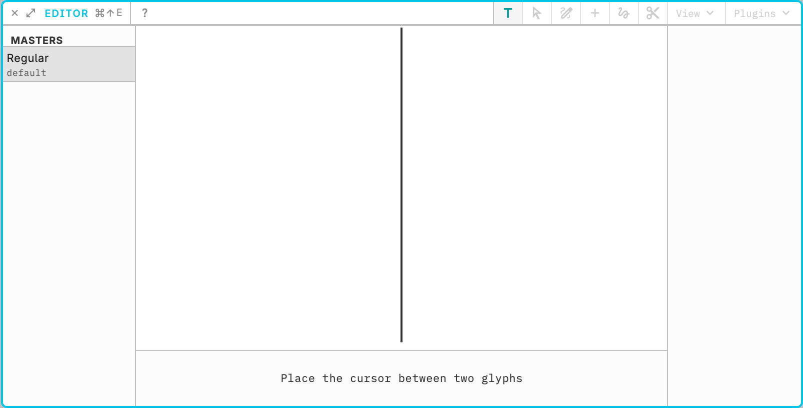

# Glyph editor

The Editor view is where visual decisions happen point by point. The useful rhythm is inspect, adjust, compare. Start with small, reversible changes so you can see how a contour behaves before you take on interpolation or components.

Open a simple glyph such as **H** or **O**. Click a point, move it a little, and watch the outline. Check sidebearings and overall balance. Undo if the change is too far.

Hold **Tab** to see sidebearings and other distances without leaving the canvas. In text mode Tab is this overlay, not a tab character. `Cmd/Ctrl+0` is two-stage zoom-to-fit: in outline mode the first press frames the glyph with extra margin (max 250%), and a second press with unchanged pan/zoom shows a 25% line overview. In text mode the first press is that line overview and the second fits the whole run. Zoom out for the whole glyph, then in for a single curve. Save after a change you want to keep.

Outline tools are in [Outline drawing](02-outline-drawing.md). Interpolation is in [Axes and masters](03-axes-masters.md). Editor shortcuts are listed under [Keyboard shortcuts](../reference/keyboard-shortcuts.md#editor).
