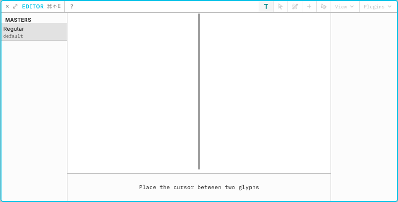

# Axes and masters

Variable font work is a set of explicit design locations connected by interpolation. Counterpunch shows those relationships so you can move between masters and intermediate states and watch shape continuity.

An **axis** is a design dimension such as weight or width. A **master** is a stored design at a location on one or more axes. **Interpolation** is the generated shape between masters. The goal is shapes that stay coherent across the design space, not only at the extremes.

Define axes and masters in Font Info panel (**Axes** and **Masters** tabs). In the Editor, the axis sliders move the current design location. Edit a glyph at one master, then at another, and move the sliders to check the path between them. Compatible point structures matter. Smooth in-betweens are the target. A jump or kink on the slider usually means the masters do not match.

A glyph that shows with **gray nodes and handles** is an interpolation which you can’t edit. Dragging a slider onto a stored layer location immediately restores that layer’s colored object-model outlines, still while the pointer is down. Layer locations are marked with small filled dots on the slider track (the same color as the track segment they sit on). The thumb snaps to a mark within 2px when approaching it; after you rest on a mark, dragging away is smooth until you leave that 2px window, then it can snap again.

Stored layers and intermediate locations are in [Layer operations](05-layer-operations.md). Terms are in the [Glossary](../reference/glossary.md).
