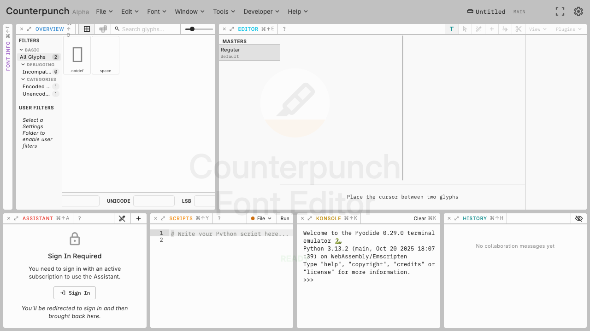

# What is Counterpunch

Counterpunch is a browser-native type design environment. Visual editing, live compilation, Python, and an AI assistant share one workspace, so you do not have to split inspection, drawing, and automation across disconnected tools.

You can open existing sources, draw and refine outlines, build variable fonts with masters and axes, write OpenType feature code, space and kern in context, and run scripts on the live font model. The compile-and-shape loop stays in the same window as the canvas.

Counterpunch is unique in that it generates an authoritative OpenType font after each edit which is immediately shaped and displayed using Harfbuzz, the leading text shaping engine. It removes the edit-compile-test cycle of established font editors, so **you are always looking at a completely functional font**. If the font behaves correctly in Counterpunch, it’s a correct font!

It is meant for first edits as well as production work. Beginners can make a controlled change and see the result immediately. Intermediate designers can move from static files into interpolation. People who already script will find Python and the assistant next to the outlines they are changing.

The two local folders are in [Project and settings folders](04-project-and-settings-folders.md). Start a session with [Your first session](02-first-session.md). The [Workspace tour](03-workspace-tour.md) names each view. Browser setup is in [Before you begin](00-before-you-begin.md).
