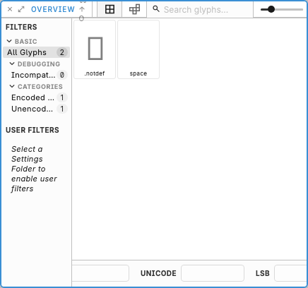

# Glyph overview

Overview is the high-level inspection surface: many glyphs at once, rather than one outline. Alternate between micro-editing in the Editor and macro-inspection here when you are checking consistency, finding outliers, or planning a pass.

Search by name (`Cmd/Ctrl+F` focuses the search field), change tile size to balance scanning and detail, and select one or more glyphs. Double-click a tile (or otherwise open the selection) to edit that glyph in the Editor. `Cmd/Ctrl+D` duplicates the selection. `Cmd/Ctrl+Shift+F` renames it. Delete or Backspace deletes it after confirm.

Narrowing the list with scripts is in [Code-driven filters](02-code-driven-filters.md). Drawing is in [Glyph editor](../editor/01-glyph-editor.md).
