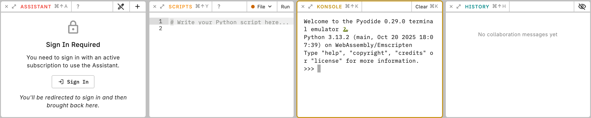

# Python in Counterpunch

Counterpunch includes an embedded Python runtime (Pyodide) so you can automate font work without switching tools or exporting intermediate data. Scripts see the currently open font. You can test an idea, inspect the result, and iterate in the same session as the outlines.

The Python environment is good for repeating edits consistently, automating cleanup, and querying the font model. The runtime stays in the browser. Konsole is for immediate exploration. Scripts is for code you intend to reuse. Overview filters are a separate kind of file; they only classify glyphs.

These helpers are already in scope and do not need to be imported:

```python
font = Font()      # open font; fails if none is open
glyph = Glyph()    # glyph being edited in edit mode
layer = Layer()    # layer being edited in edit mode
master = Master()  # selected master in edit or text mode
```

`Glyph()` and `Layer()` raise when outline editing is inactive. `Master()` uses the active layer in outline mode, or the selected master in text mode.



The object model is documented in [Python API](06-python-api.md). Start writing in [Script editor](02-script-editor-workflow.md). Quick commands are in [Konsole](03-konsole-quick-tasks.md). Plugins and extra packages are in [Installing plugins and packages](07-installing-plugins-and-packages.md).
